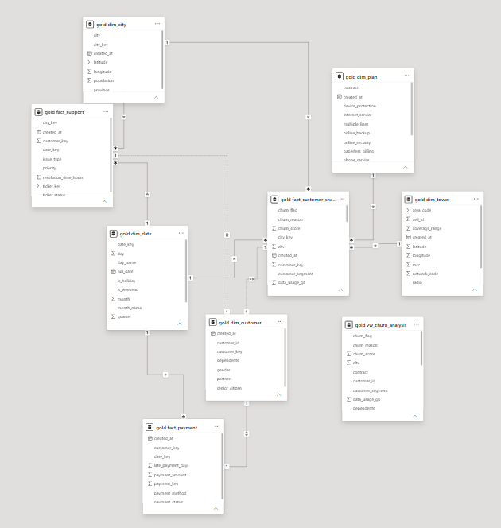
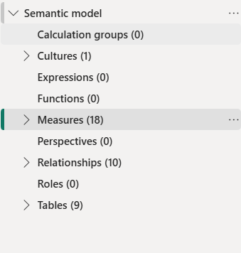

# 📡 Telecom Customer Analytics & Churn Intelligence Platform

An enterprise-grade, end-to-end data analytics platform built to demonstrate production-level skills in **Data Engineering**, **Data Warehousing**, **SQL Analytics**, **Business Intelligence**, and **Machine Learning** using a real telecom customer base as the business domain.


---

# 📌 Project Overview

This project simulates a complete **Telecom Customer Analytics Platform**, beginning with raw operational datasets and ending with executive dashboards and a machine learning churn prediction model.

Unlike a simple analytics project, this repository follows an enterprise-inspired architecture using:

- Bronze → Silver → Gold Medallion Architecture
- PostgreSQL Enterprise Data Warehouse
- Star Schema Data Modeling
- Python ETL Pipelines
- SQL Analytics Layer
- Power BI Executive Dashboards
- Machine Learning Churn Prediction

The objective is to replicate how a modern telecom company transforms raw operational data into actionable business insights for executives, managers, analysts, and data scientists.

---

# 🎯 Business Problem

Telecommunication companies lose millions every year because of customer churn.

The business requires answers to questions such as:

- Which customers are most likely to churn?
- Which subscription plans generate the highest revenue?
- Which geographic regions have the highest churn?
- Which contract types retain customers best?
- Which network quality metrics influence churn?
- Which customers should be targeted for retention campaigns?
- What revenue is currently at risk?
- Which support issues correlate with churn?

This platform answers these questions through an integrated analytics solution.

---

# 🏗 Enterprise Architecture

```
                    RAW DATA SOURCES
                           │
        ┌──────────────────┼──────────────────┐
        │                  │                  │
Customer Data        Network Data      Geographic Data
        │                  │                  │
        └──────────────────┼──────────────────┘
                           │
                    Bronze Layer
             Raw Data Ingestion (Python)
                           │
                           ▼
                    Silver Layer
          Cleaning • Validation • Standardization
                           │
                           ▼
                     Gold Layer
             PostgreSQL Data Warehouse
                    (Star Schema)
                           │
                           ▼
                 SQL Analytics Layer
            Views • KPIs • Business Queries
                           │
          ┌────────────────┴─────────────────┐
          │                                  │
          ▼                                  ▼
   Power BI Dashboards              Machine Learning
                                    Churn Prediction
```

---

# 🏢 Business Process

```
Customers
      │
Purchase Telecom Plans
      │
Generate Monthly Bills
      │
Make Payments
      │
Contact Customer Support
      │
Use Telecom Network
      │
Generate Operational Data
      │
ETL Processing
      │
Data Warehouse
      │
Business Analytics
      │
Executive Decision Making
```

---

# 📂 Data Sources

| # | Dataset | Purpose | Records |
|---|---------|---------|---------|
| 1 | IBM Telco Customer Churn | Customer master dataset | 7,043 |
| 2 | IBM Telco Customer Churn (Extended) | CLTV, Churn Score, Geography | 7,043 |
| 3 | Pakistan Cities Dataset | Geographic Dimension | 146 |
| 4 | Date Dimension | Calendar Dimension | 4,748 |
| 5 | OpenCelliD Pakistan (MCC 410) | Telecom Tower Infrastructure | 4,225 |

> **Note**
>
> IBM's original customer dataset contains U.S. customer locations.
>
> For demonstration purposes, customers are assigned randomized Pakistani cities so the warehouse can demonstrate complete geographic analytics.
>
> In production systems, customer geography would come directly from operational CRM systems.

---

# ⭐ Star Schema Design

## Fact Table Grain

**fact_customer_snapshot**

One row represents:

> One Customer × One Month

This allows:

- Monthly Revenue Analysis
- Monthly Churn Analysis
- Customer Lifetime Tracking
- Monthly KPI Reporting
- Machine Learning Feature Generation

---

# 🌟 Star Schema

```
                    ┌───────────────────┐
                    │     dim_date      │
                    └─────────┬─────────┘
                              │
                              │
      ┌───────────────┐   ┌────▼────────────────────┐   ┌───────────────┐
      │ dim_customer  ├──►│ fact_customer_snapshot │◄──┤   dim_plan    │
      └───────────────┘   └────▲────────────────────┘   └───────────────┘
                               │
                               │
         ┌─────────────────────┼──────────────────────┐
         │                     │                      │
         ▼                     ▼                      ▼
   dim_city              dim_tower            dim_date

                fact_payment        fact_support
```

---

# 📋 Data Warehouse Tables

| Table | Type | Grain |
|------|------|------|
| dim_customer | Dimension | One row per customer |
| dim_plan | Dimension | One row per plan |
| dim_city | Dimension | One row per city |
| dim_date | Dimension | One row per day |
| dim_tower | Dimension | One row per telecom tower |
| fact_customer_snapshot | Fact | One row per customer per month |
| fact_payment | Fact | One row per payment |
| fact_support | Fact | One row per support ticket |

---

# 🛠 Technology Stack

| Layer | Technology |
|---------|------------|
| Programming | Python 3.11 |
| Database | PostgreSQL 17 |
| ETL | Pandas, SQLAlchemy, psycopg2 |
| Data Warehouse | Star Schema |
| Analytics | SQL |
| Machine Learning | Scikit-learn, XGBoost |
| Dashboard | Power BI Desktop |
| Version Control | Git & GitHub |
| Documentation | Markdown |

---

# 📁 Project Structure

```text
telecom-customer-analytics-platform/
│
├── data/
│   └── raw/
│       ├── WA_Fn-UseC_-Telco-Customer-Churn.csv
│       ├── Telco_customer_churn.xlsx
│       ├── pk.csv
│       └── 410.csv
│
├── database/
│   ├── V001__create_database.sql
│   ├── V002__create_schemas.sql
│   ├── V003__create_dim_tables.sql
│   ├── V004__create_fact_tables.sql
│   ├── V005__create_indexes.sql
│   └── V006__create_unknown_records.sql
│
├── docs/
│   ├── business_process.md
│   ├── dataset_inventory.md
│   ├── dimension_design.md
│   ├── fact_design.md
│   ├── fact_table_grain.md
│   ├── key_strategy.md
│   ├── kpi_catalog.md
│   ├── source_mapping.md
│   ├── star_schema_design.md
│   └── transformation_rules.md
│
├── etl/
│   ├── bronze/
│   ├── silver/
│   ├── gold/
│   └── config.py
│
├── sql/
│   ├── V001__customer_analytics.sql
│   ├── V002__revenue_analytics.sql
│   ├── V003__churn_analytics.sql
│   ├── V004__network_analytics.sql
│   ├── V005__geographic_analytics.sql
│   ├── V006__payment_analytics.sql
│   ├── V007__support_analytics.sql
│   ├── V008__executive_kpis.sql
│   └── V009__analytical_views.sql
│
├── ml/
│   ├── churn_model.py
│   └── outputs/
│       ├── churn_model.pkl
│       ├── model_results.csv
│       └── feature_importance.csv
│
├── powerbi/
│   ├── telecom_dashboard.pbix
│   └── telecom_theme.json
│
├── images/
│   ├── 01_executive_summary.png.png
│   ├── 02_customer_analytics.png.png
│   ├── 03_churn_analysis.png.png
│   ├── 04_revenue_analysis.png.png
│   ├── 05_network_performance.png.png
│   ├── 06_support_payments.png.png
│   ├── Data Model.png.png
│   ├── Sementic model.png.png
│   └── data tables.png.png
│
├── notebooks/
│   ├── data_profiling_notebook.ipynb
│   └── profiling_outputs/
│
├── requirements.txt
├── README.md
└── .gitignore
```

> **Note:** The image filenames above match your current repository. If you later rename them to remove the duplicate `.png`, update the README image paths accordingly.

---

# 📊 Power BI Dashboard

The Power BI solution consists of six interactive dashboard pages built using a professional dark theme with KPI cards, slicers, drill-through navigation, bookmarks, and DAX measures.

The dashboards are connected directly to the PostgreSQL Data Warehouse.

---

## Dashboard Pages

| Dashboard | Purpose |
|------------|---------|
| Executive Summary | Overall company KPIs |
| Customer Analytics | Customer segmentation and demographics |
| Churn Analysis | Churn behaviour and churn drivers |
| Revenue Analysis | Revenue trends and customer value |
| Network Performance | Tower analytics and network KPIs |
| Support & Payments | Support tickets and payment analysis |

---

# 📸 Dashboard Screenshots

## Executive Summary


---

## Customer Analytics


---

## Churn Analysis


---

## Revenue Analysis


---

## Network Performance


---

## Support & Payments


---

# 🗄 Data Warehouse Model

## Physical Data Model



---

## Semantic Model



---

## Source Tables


---

# 📈 SQL Analytics

The warehouse contains a collection of analytical SQL scripts covering multiple business domains.

### Customer Analytics

- Customer segmentation
- Customer demographics
- Customer tenure
- Contract distribution
- Internet service usage

---

### Revenue Analytics

- Monthly revenue
- Revenue by contract
- Revenue by payment method
- Revenue by city
- Revenue by customer segment

---

### Churn Analytics

- Churn rate
- Churn reasons
- Churn by gender
- Churn by contract
- Churn by internet service
- Churn by city
- Churn by tenure

---

### Network Analytics

- Tower density
- Radio technology distribution
- Average network score
- Signal quality
- Latency analysis

---

### Geographic Analytics

- Customer distribution
- Revenue by city
- Churn by city
- Regional performance

---

### Payment Analytics

- Payment method analysis
- Monthly payment trends
- Outstanding revenue
- Payment success rate

---

### Support Analytics

- Ticket volume
- Resolution status
- Average resolution time
- Support category analysis

---

### Executive KPIs

The SQL layer produces KPIs such as:

- Total Customers
- Active Customers
- Churn Rate
- Monthly Revenue
- Annual Revenue
- Customer Lifetime Value
- Average Monthly Charges
- Average Tenure
- Revenue at Risk
- Support Ticket Count

---

# 🤖 Machine Learning

The project includes a complete machine learning pipeline for customer churn prediction.

The model is trained using engineered features extracted directly from the Gold Layer Data Warehouse.

---

## Algorithms Evaluated

- Logistic Regression
- Random Forest
- XGBoost

The best-performing model is XGBoost.

---

## Model Performance

| Metric | **Random Forest (Best)** | XGBoost |
|--------|--------------------------|---------|
| Accuracy | **80.34%** | 79.99% |
| Precision | **69.32%** | 66.20% |
| Recall | 46.52% | **50.27%** |
| F1 Score | 55.68% | **57.14%** |
| **ROC AUC** | **84.13%** | 83.71% |

> **Data Leakage Fix:** `churn_score` was intentionally excluded from all models.
> It is IBM's pre-computed propensity score derived from the actual churn outcome,
> causing data leakage (correlation with churn_flag = 0.665).
> Including it artificially inflated ROC AUC to 98.31%.
> The numbers above reflect a clean, production-honest model.

## Top Churn Predictors

| Rank | Feature | Importance |
|------|---------|-----------|
| 1 | Tenure Months | 9.5% |
| 2 | Contract Type | 9.5% |
| 3 | Total Charges | 8.2% |
| 4 | Monthly Charges | 7.0% |
| 5 | Online Security | 5.1% |
| 6 | Tech Support | 4.5% |
| 7 | Data Usage GB | 4.3% |
| 8 | Customer Segment | 4.0% |
| 9 | CLTV | 3.8% |
| 10 | Signal Strength | 3.8% |

## Machine Learning Outputs

```
ml/
└── outputs/
    ├── churn_model.pkl
    ├── feature_importance.csv
    └── model_results.csv
```

---

# 📚 Documentation

Complete project documentation is available inside the `docs/` directory.

Included documentation:

- Business Process
- Dataset Inventory
- Star Schema Design
- Source Mapping
- KPI Catalog
- Transformation Rules
- Fact Table Design
- Dimension Design
- Key Strategy
- Fact Table Grain

---

# 📋 Data Quality

The ETL pipeline performs:

- Duplicate removal
- Missing value handling
- Data type validation
- Standardization
- Business rule validation
- Unknown member handling
- Logging rejected records

Rejected records are stored inside:

```
logs/rejected_records.csv
```
---

# ⚙️ Setup & Reproduction

This section explains how to reproduce the complete project from scratch.

---

## Prerequisites

Before running the project, install the following software:

| Software | Version |
|-----------|---------|
| PostgreSQL | 17+ |
| Python | 3.11+ |
| Power BI Desktop | Latest |
| Git | Latest |
| Visual Studio Code | Recommended |

---

# 1. Clone the Repository

```bash
git clone https://github.com/Saad-Ahmed-DS/telecom-customer-analytics-platform.git

cd telecom-customer-analytics-platform
```

---

# 2. Install Python Dependencies

```bash
pip install -r requirements.txt
```

---

# 3. Configure Environment Variables

Create a file named

```
.env
```

inside the project root.

Example:

```env
DB_HOST=localhost
DB_PORT=5432
DB_NAME=telecom_dw
DB_USER=postgres
DB_PASSWORD=your_password_here
```

> **Important**
>
> Never commit the `.env` file to GitHub.
>
> The repository already ignores it using `.gitignore`.

---

# 4. Create PostgreSQL Database

Open pgAdmin or any PostgreSQL client.

Run the SQL scripts located inside

```
database/
```

Execute them **in order**.

```
V001__create_database.sql

↓

V002__create_schemas.sql

↓

V003__create_dim_tables.sql

↓

V004__create_fact_tables.sql

↓

V005__create_indexes.sql

↓

V006__create_unknown_records.sql
```

After execution the warehouse contains:

- Dimension tables
- Fact tables
- Indexes
- Unknown Members
- Schemas

---

# 5. Run the ETL Pipeline

Execute each ETL layer in sequence.

### Bronze Layer

```bash
python etl/bronze/ingest_raw.py
```

Purpose

- Load raw files
- Preserve original data
- No transformations

---

### Silver Layer

```bash
python etl/silver/clean_data.py
```

Purpose

- Remove duplicates
- Handle NULL values
- Standardize values
- Validate business rules

---

### Gold Layer

Load Dimensions

```bash
python etl/gold/load_dimensions.py
```

Load Facts

```bash
python etl/gold/load_facts.py
```

Purpose

- Populate Star Schema
- Generate surrogate keys
- Maintain referential integrity

---

# 6. Execute SQL Analytics

Run every SQL script inside

```
sql/
```

in sequence.

```
V001

↓

V002

↓

V003

↓

V004

↓

V005

↓

V006

↓

V007

↓

V008

↓

V009
```

These scripts create:

- Analytical Views
- KPIs
- Business Reports
- Executive Metrics

---

# 7. Train Machine Learning Model

Run

```bash
python ml/churn_model.py
```

Outputs generated:

```
ml/
└── outputs/
    ├── churn_model.pkl
    ├── model_results.csv
    └── feature_importance.csv
```

---

# 8. Open Power BI Dashboard

Open

```
powerbi/
```

Load

```
telecom_dashboard.pbix
```

Update the PostgreSQL connection if required.

Refresh the dataset.

The dashboard will automatically use the latest warehouse data.

---

# 🎯 Key Design Decisions

## Medallion Architecture

The project follows the Bronze → Silver → Gold architecture.

Advantages

- Clean separation of layers
- Easier debugging
- Better maintainability
- Industry-standard architecture

---

## Star Schema

A Star Schema was chosen because it provides

- Faster reporting
- Simpler SQL
- Better Power BI performance
- Easier business understanding

---

## Surrogate Keys

Every dimension uses surrogate keys generated by PostgreSQL.

Benefits

- Stable joins
- Better performance
- Simplified Slowly Changing Dimensions
- Independent from source systems

---

## Unknown Members

Every dimension includes an Unknown Record.

Benefits

- No NULL foreign keys
- Referential integrity
- Cleaner ETL processing

---

## Modular SQL

SQL scripts are versioned.

Example

```
V001__

V002__

V003__
```

Benefits

- Easier deployment
- Better version control
- Repeatable builds

---

# 📈 Business Insights

Example insights generated by the platform include:

- Month-to-month contracts exhibit the highest churn rate.
- Fiber Optic customers generate the highest revenue but also show elevated churn risk.
- Longer customer tenure is associated with significantly lower churn probability.
- Customers with high churn scores represent substantial revenue at risk.
- Poor network quality is correlated with increased customer churn.
- Electronic check users display higher churn compared to automatic payment methods.
- Premium contract plans contribute disproportionately to overall revenue.
- Support ticket volume can be used as an early indicator of potential churn.

---

# 🚀 Future Improvements

Potential future enhancements include:

- Apache Airflow orchestration
- Docker containerization
- CI/CD using GitHub Actions
- Azure Data Factory pipelines
- Snowflake Data Warehouse
- Microsoft Fabric integration
- Real-time Kafka ingestion
- Streaming analytics
- REST API layer
- Automated report deployment

---

# 👤 Author

**Saad Ahmed**

This project was developed as a flagship portfolio project to demonstrate practical skills in:

- Data Engineering
- Data Warehousing
- SQL Analytics
- Business Intelligence
- Machine Learning

GitHub

https://github.com/Saad-Ahmed-DS

Repository

https://github.com/Saad-Ahmed-DS/telecom-customer-analytics-platform

---

# 📄 License

This project is intended for educational and portfolio purposes.

Datasets used include publicly available sources such as:

- IBM Telco Customer Churn
- Pakistan Cities Dataset
- OpenCelliD

All trademarks and datasets remain the property of their respective owners.

---

# ⭐ Recommended GitHub Repository Topics

Add the following topics to your GitHub repository.

```
data-engineering

postgresql

python

etl

sql

analytics

business-intelligence

powerbi

machine-learning

xgboost

star-schema

data-warehouse

telecom
```

---

# 🔒 Security

The `.env` file is intentionally excluded from version control.

If it has accidentally been committed previously, remove it using:

```bash
git rm --cached .env

git commit -m "Remove .env from repository"

git push
```

If your `.env` contained real passwords or credentials, rotate those credentials immediately.

---

# 📤 GitHub Workflow

After making changes to the project:

Check status

```bash
git status
```

Stage files

```bash
git add .
```

Commit changes

```bash
git commit -m "Describe your changes"
```

Push to GitHub

```bash
git push
```

View configured remote

```bash
git remote -v
```

View commit history

```bash
git log --oneline
```

Check current branch

```bash
git branch
```

---

# 🎉 Acknowledgements

Special thanks to the providers of the publicly available datasets and the open-source tools that made this project possible.

This repository demonstrates an end-to-end analytics workflow inspired by real-world enterprise data platforms and is intended to showcase practical experience in building modern data engineering and business intelligence solutions.

---

## ⭐ If you found this project interesting, consider giving it a star on GitHub!